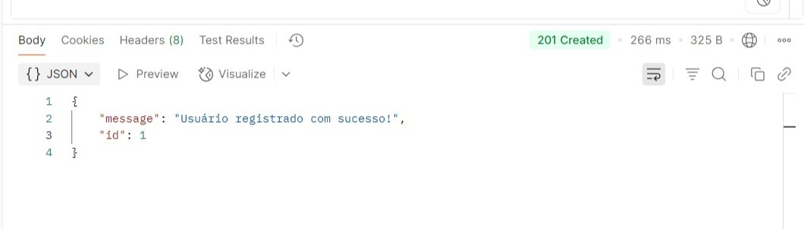
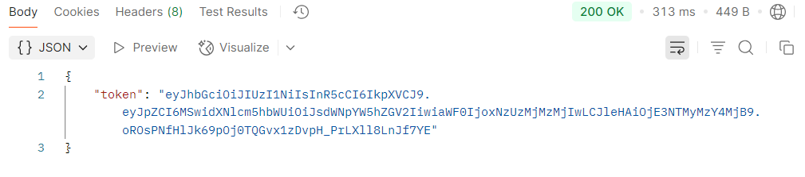
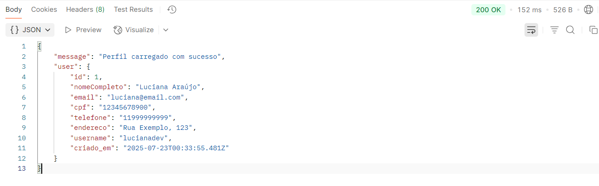

🔐 Sistema de Autenticação com Node.js

🔗 Projeto publicado no GitHub: [LucianaAraujox/backend-autenticacao](https://github.com/LucianaAraujox/backend-autenticacao)

Este projeto é um sistema web para cadastro, login, visualização de perfil e listagem de usuárias. Foi desenvolvido com HTML, CSS, JavaScript no frontend e Node.js com Express no backend.

⚙️ Tecnologias usadas

- **FrontEnd:** HTML, CSS, JavaScript
- **Backend:** Node.js, Express
- **Banco de Dados:** PostgreSQL
- **ORM:** Sequelize
- **Autenticação:** JSON Web Token (JWT), bcrypt
- **Testes:** Postman
- **Utilitários:** dotenv, cors

📁 Arquitetura do Projeto

backend-autenticacao/
├── .vscode/
│   └── settings.json
├── .env
├── package.json
├── README.md               # documentação do projeto
│
├── config/
│   ├── config.json         # usado pelo Sequelize
│   └── database.js         # conexão com PostgreSQL usando Sequelize
│
├── models/
│   ├── index.js            # carrega os modelos e instância sequelize
│   ├── usuario.js          # definição da tabela Usuario
│   └── perfil.js           # definição da tabela Perfil
│
├── migrations/             
│
├── src/
│   ├── controllers/
│   │   ├── userController.js     # funções de autenticação e perfil
│   │   └── perfilController.js  
│   │
│   ├── routes/
│   │   ├── userRoutes.js         # cadastro, login, perfil
│   │   └── pingRoutes.js         # rota de teste de conexão
│   │
│   ├── middlewares/
│   │   └── middlewares.js        # tratamento de autenticação, erros etc.
│   │
│   ├── server.js                 # inicia app Express
│   └── index.js                  # carrega os modelos e instancia
│
├── docs/
│   └── descritivo.md             # introdução
│
├── frontend/
│   ├── index.html
│   ├── cadastro.html
│   ├── login.html
│   ├── perfil.html
│   └── usuarios.html
│
└── node_modules

🚀 Funcionalidades

- Cadastro de usuárias com hash de senha (letras e números)
- Login e geração de token JWT
- Visualização de perfil da usuária autenticada
- Testes com Postman e navegador
- Banco de dados estruturado com Sequelize

📦 Rotas da API

| Método | Rota        | Descrição                        

| POST   | /api/user   | Cadastrar novo usuário          
| POST   | /api/login  | Autenticar e retornar token JWT  
| GET    | /api/me     | Retorna dados da usuário logado  
| GET    | /api/users  | Lista todos os usuários          
| GET    | /api/ping   | Teste de status da API       

📌 Para acessar `/api/me` e `/api/users`, envie o token no header:

Authorization: Bearer token 

>> Como executar

1. Instale os pacotes no backend:

npm install

2. Rode/Inicie o servidor:

node src/server.js

📌 Descrição

Permite:
- Registro de usuários com criptografia de senha
- Login com geração de token JWT
- Rota protegida que retorna os dados do perfil autenticado
- Interface moderna e estilizada para cadastro e login

>> Instruções de Instalação e Execução

Pré-requisitos:

- Node.js instalado
- PostgreSQL rodando localmente
- VS Code recomendado

Criei um arquivo .env (Armazena variáveis sensíveis) com:

PORT=3000
DB_NAME=seu_banco
DB_USER=seu_usuario
DB_PASS=sua_senha
DB_HOST=localhost
JWT_SECRET=sua_chave_secreta

3. Abra os arquivos HTML no navegador com Live Server

🛠️ Explicando os comandos Git detalhadamente

| Comando                        | Significado                                                                

| git init                    | Inicializa o controle de versão no meu projeto local                        
| git branch -M main          | Renomeia a branch atual para `main` (padrão moderno do Git)                 
| git remote add origin URL   | Conecta o meu projeto local ao repositório no GitHub                         
| git add .                   | Adiciona todos os arquivos modificados/preparados para commit              
| git commit -m "mensagem"    | Cria um registro das alterações com uma mensagem de descrição              
| git push -u origin main     | Envia os commits locais para a branch `main` do repositório no GitHub      

~ Projeto desenvolvido por Luciana com muito café, desespero e persistência!  

